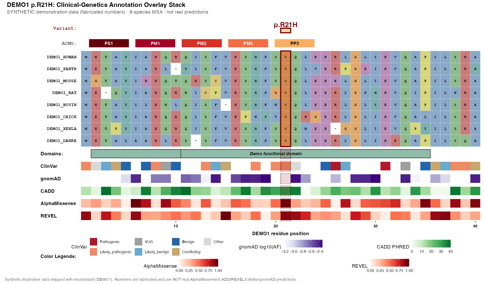

# msaVariant

`msaVariant` produces publication-quality figures for a **single genetic
variant**: a cross-species protein **multiple sequence alignment** with
per-column **conservation**, stacked **annotation tracks** (ClinVar,
gnomAD, AlphaMissense, REVEL, CADD, protein domains), and an automatic
**ACMG evidence-code strip** (PS1, PM1, PM2, PM5, PP3) computed straight
from the data. It is built on top of
[`ggmsa`](https://github.com/YuLab-SMU/ggmsa) and returns a normal
`ggplot`/`patchwork` object, so every layer, colour, and label stays
fully customisable for figures you can drop into a paper.

## 🔨 Installation

Install the visual base [`ggmsa`](https://github.com/YuLab-SMU/ggmsa)
(Bioconductor), then `msaVariant` from GitHub:

```r
# ggmsa (required base) + Bioconductor deps
if (!requireNamespace("BiocManager", quietly = TRUE))
  install.packages("BiocManager")
BiocManager::install("ggmsa")

# msaVariant (development version)
# install.packages("devtools")
devtools::install_github("ramizkrdnz/msaVariant")
```

## 💡 Quick Example

One call assembles the whole figure. This example runs **out of the
box** — it uses the small **synthetic `DEMO1` bundle that ships with the
package** (via `import_local_bundle()`), so no Zenodo download and no
external data are needed:

```r
library(msaVariant)

# 1. Load the bundled synthetic DEMO1 example into the cache (no Zenodo)
import_local_bundle(
  system.file("extdata", "DEMO1.rds", package = "msaVariant"),
  gene = "DEMO1"
)

# 2. Build the full overlay figure for the demo variant DEMO1 p.R21H
plot_variant_overlay(
  gene          = "DEMO1",
  aligned_fasta = system.file("extdata", "demo_aligned.fasta",
                              package = "msaVariant"),
  variant_pos   = 21,
  variant_label = "p.R21H"
)
```



> **⚠️ `DEMO1` is synthetic.** Every number in this figure is fabricated
> illustrative data — **not** real AlphaMissense / CADD / REVEL / ClinVar /
> gnomAD predictions. It exists only to let the example run out-of-the-box
> and to show the figure layout. `DEMO1` is not a real gene.

The synthetic variant `DEMO1 p.R21H` is engineered so that all five ACMG
codes fire — **PS1, PM1, PM2, PM5, PP3** — computed automatically from the
bundled tables, exactly as they would be for real data.

## 📚 Learn more

Full articles are on the documentation site,
**<https://ramizkrdnz.github.io/msaVariant/>**:

- [**Get Started**](https://ramizkrdnz.github.io/msaVariant/articles/introduction.html)
  — install, load data, and build your first overlay.
- [Full workflow tutorial](https://ramizkrdnz.github.io/msaVariant/articles/tutorial_full_workflow.html)
  — end-to-end, from FASTA to finished figure.
- [ACMG Evidence Codes](https://ramizkrdnz.github.io/msaVariant/articles/acmg-evidence-codes.html)
  — how PS1/PM1/PM2/PM5/PP3 are computed, and tuning `pp3_min_predictors`.
- [Annotation Tracks](https://ramizkrdnz.github.io/msaVariant/articles/annotation-tracks.html)
  — the ClinVar / gnomAD / AlphaMissense / REVEL / CADD and domain tracks,
  and how each is aggregated per residue.
- [Colour Schemes](https://ramizkrdnz.github.io/msaVariant/articles/colour-schemes.html)
  — `journal`, `colorblind` (Okabe–Ito), `grayscale`, and per-element overrides.
- [Toggling Layers](https://ramizkrdnz.github.io/msaVariant/articles/toggling-layers.html)
  — show/hide any track; the layout re-flows with no gaps.
- [Bring Your Own Data](https://ramizkrdnz.github.io/msaVariant/articles/bring-your-own-data.html)
  — overlay your own annotations with `geom_track()`, or import your own bundle.

## 🧬 Bring-your-own-data mode

No Zenodo bundle required — overlay any per-residue values you already
have:

```r
my_data <- data.frame(pos = 510:530, score = runif(21))
ggmsa::ggmsa(fa) +
  geom_track(my_data, msa = fa, value = "score", name = "Custom track")
```

## ⚠️ Data upload pending

The Zenodo data deposit is **not yet published**, so remote fetches
(`fetch_gene_data()` and the gene-symbol annotation layers) will
currently fail. Until the deposit is live, use your own data via
*Bring-your-own-data mode* above, or load a local bundle with
`import_local_bundle()` (as in the Quick Example). This note will be
removed once the deposit is uploaded and wired in.

## 📄 License

`msaVariant` is released under the **Artistic-2.0** license.

Note that data fetched via `geom_alphamissense()` is licensed
**CC-BY-NC-SA 4.0**, which restricts commercial use of works derived
from it. Check the license of every annotation source you display before
reusing a figure.

## 🏃 Author

*Author and maintainer details are pending and will be added here.*
