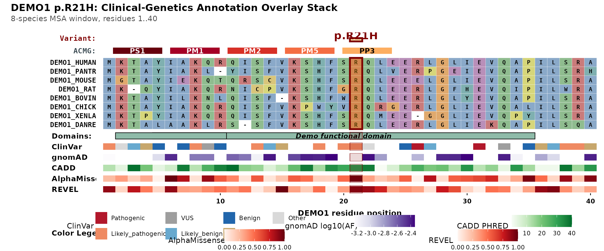

# Introduction to msaVariant

## What this package does

`msaVariant` overlays clinical-genetics evidence onto a multiple
sequence alignment (MSA) in a single figure. Each layer paints a
different kind of evidence:

- **the variant** — the patient’s substitution, highlighted through
  every panel
- **protein domains** — InterPro/Pfam regions
- **gnomAD** — population allele frequencies
- **ClinVar** — clinical pathogenicity calls
- **AlphaMissense / REVEL / CADD** — in-silico pathogenicity scores
- an automatic **ACMG evidence-code** strip (PS1, PM1, PM2, PM5, PP3)
- **[`geom_track()`](https://ramizkrdnz.github.io/msaVariant/reference/geom_track.md)**
  — a generic per-residue track (bring your own data)

## A runnable example

Everything below uses the synthetic **`DEMO1`** bundle that ships with
the package — fabricated data, no network, no real predictions — so it
runs out of the box. We point the cache at a temporary directory so the
example never touches your real cache.

``` r

library(msaVariant)

Sys.setenv(MSAVARIANT_CACHE = tempfile("msaVariant_cache_"))
import_local_bundle(
  system.file("extdata", "DEMO1.rds", package = "msaVariant"),
  gene = "DEMO1"
)

plot_variant_overlay(
  gene          = "DEMO1",
  aligned_fasta = system.file("extdata", "demo_aligned.fasta",
                              package = "msaVariant"),
  variant_pos   = 21,
  variant_label = "p.R21H"
)
```



The five “Learn more” guides build on this:
[`vignette("acmg-evidence-codes")`](https://ramizkrdnz.github.io/msaVariant/articles/acmg-evidence-codes.md),
[`vignette("annotation-tracks")`](https://ramizkrdnz.github.io/msaVariant/articles/annotation-tracks.md),
[`vignette("colour-schemes")`](https://ramizkrdnz.github.io/msaVariant/articles/colour-schemes.md),
[`vignette("toggling-layers")`](https://ramizkrdnz.github.io/msaVariant/articles/toggling-layers.md),
and
[`vignette("bring-your-own-data")`](https://ramizkrdnz.github.io/msaVariant/articles/bring-your-own-data.md).

## How the data layer works for real genes

For a real gene you do not ship the data yourself. The annotation tables
(`gnomAD`, `ClinVar`, `AlphaMissense`, `REVEL`, `CADD`, domains) are
fetched from a Zenodo deposit the first time you use a gene, then cached
locally. The package code itself ships with no clinical-genetics data —
only the visualisation machinery and the synthetic `DEMO1` example.

This means:

1.  The package install is small and fast.
2.  You always get the data version pinned to the package release, so
    the figure is reproducible.
3.  Updating the data (when gnomAD releases a new version, say) is a
    matter of re-running the build scripts and re-uploading to Zenodo.

The chunk below shows the real-gene workflow with `ggmsa`. It is not run
here because it needs the (Suggested) `ggmsa` package and network access
to the deposit; see
[`vignette("tutorial_full_workflow")`](https://ramizkrdnz.github.io/msaVariant/articles/tutorial_full_workflow.md)
for the end-to-end version.

``` r

library(ggmsa)
library(msaVariant)

# Your alignment: PATL1 orthologs around residue 518
fa <- system.file("extdata", "patl1_orthologs.fasta",
                  package = "msaVariant")

# The patient's variant
patient <- data.frame(
  pos         = 29,                # K518 in the demo stretch
  pos_end     = 61,                # frameshift through end of window
  label       = "K518fs",
  consequence = factor("frameshift",
                       levels = c("frameshift","missense","nonsense"))
)

ggmsa(fa, char_width = 0.6, seq_name = TRUE) +
  geom_variant(patient,                  msa = fa) +
  geom_domain(gene = "PATL1",            msa = fa) +
  geom_clinvar(gene = "PATL1",           msa = fa) +
  geom_alphamissense(gene = "PATL1",     msa = fa) +
  geom_gnomad(gene = "PATL1",            msa = fa)
```

## Bringing your own data

If you already have a custom annotation (a lab-internal database, a
paper’s supplementary table, etc.), pass it via
[`geom_track()`](https://ramizkrdnz.github.io/msaVariant/reference/geom_track.md)
instead of a gene symbol. This chunk also needs `ggmsa`, so it is shown
but not run; see
[`vignette("bring-your-own-data")`](https://ramizkrdnz.github.io/msaVariant/articles/bring-your-own-data.md)
for a runnable version.

``` r

my_annotations <- read.csv("my_annotations.csv")   # cols: pos, score
ggmsa::ggmsa(fa) +
  geom_track(my_annotations, msa = fa,
             value = "score", name = "My score")
```

## Cache management

``` r

cache_location()       # where the cache lives
cache_summary()        # what is currently cached
clear_cache()          # remove everything
clear_cache("gnomad")  # remove only one slice
```

## Citation

If you use `msaVariant` in published work, please cite both the package
and the underlying data sources (see the Zenodo deposit README for the
full citation list).

## Session info

``` r

sessionInfo()
#> R version 4.6.1 (2026-06-24)
#> Platform: x86_64-pc-linux-gnu
#> Running under: Ubuntu 24.04.4 LTS
#> 
#> Matrix products: default
#> BLAS:   /usr/lib/x86_64-linux-gnu/openblas-pthread/libblas.so.3 
#> LAPACK: /usr/lib/x86_64-linux-gnu/openblas-pthread/libopenblasp-r0.3.26.so;  LAPACK version 3.12.0
#> 
#> locale:
#>  [1] LC_CTYPE=C.UTF-8       LC_NUMERIC=C           LC_TIME=C.UTF-8       
#>  [4] LC_COLLATE=C.UTF-8     LC_MONETARY=C.UTF-8    LC_MESSAGES=C.UTF-8   
#>  [7] LC_PAPER=C.UTF-8       LC_NAME=C              LC_ADDRESS=C          
#> [10] LC_TELEPHONE=C         LC_MEASUREMENT=C.UTF-8 LC_IDENTIFICATION=C   
#> 
#> time zone: UTC
#> tzcode source: system (glibc)
#> 
#> attached base packages:
#> [1] stats     graphics  grDevices utils     datasets  methods   base     
#> 
#> other attached packages:
#> [1] msaVariant_0.2.0
#> 
#> loaded via a namespace (and not attached):
#>  [1] gtable_0.3.6        jsonlite_2.0.0      dplyr_1.2.1        
#>  [4] compiler_4.6.1      crayon_1.5.3        tidyselect_1.2.1   
#>  [7] Biostrings_2.80.1   jquerylib_0.1.4     systemfonts_1.3.2  
#> [10] IRanges_2.46.0      Seqinfo_1.2.0       scales_1.4.0       
#> [13] textshaping_1.0.5   yaml_2.3.12         fastmap_1.2.0      
#> [16] ggplot2_4.0.3       R6_2.6.1            XVector_0.52.0     
#> [19] patchwork_1.3.2     labeling_0.4.3      generics_0.1.4     
#> [22] knitr_1.51          BiocGenerics_0.58.1 htmlwidgets_1.6.4  
#> [25] tibble_3.3.1        desc_1.4.3          pillar_1.11.1      
#> [28] bslib_0.11.0        RColorBrewer_1.1-3  rlang_1.3.0        
#> [31] cachem_1.1.0        xfun_0.60           S7_0.2.2           
#> [34] fs_2.1.0            sass_0.4.10         otel_0.2.0         
#> [37] cli_3.6.6           withr_3.0.3         magrittr_2.0.5     
#> [40] pkgdown_2.2.1       digest_0.6.39       grid_4.6.1         
#> [43] cowplot_1.2.0       lifecycle_1.0.5     vctrs_0.7.3        
#> [46] S4Vectors_0.50.1    evaluate_1.0.5      glue_1.8.1         
#> [49] farver_2.1.2        ragg_1.5.2          stats4_4.6.1       
#> [52] rmarkdown_2.31      pkgconfig_2.0.3     tools_4.6.1        
#> [55] htmltools_0.5.9
```
